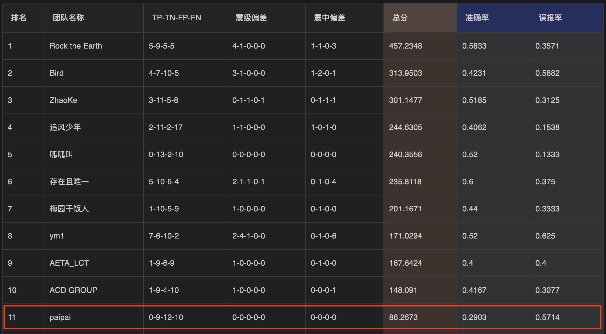

# iAETA
iAETA(基于大数据与AI的地震临震预测)

>
> http://www.ceic.ac.cn/history
>


>
> https://platform.aeta.cn/zh-CN/competitionpage/leaderboard
> 


```shell
# 有震预测 earthquake prediction
check_my_prediction(myToken, '2023-03-05', '2023-03-11', 1, latitude=28.506894, longitude=102.636712, magnitude=3.6)


# 有震预测 earthquake prediction
check_my_prediction(myToken, '2023-03-05', '2023-03-11', 1, latitude=26.419792, longitude=100.937875, magnitude=3.5)


# 有震预测 earthquake prediction
check_my_prediction(myToken, '2023-03-05', '2023-03-11', 1, latitude=27.186947, longitude=102.642132, magnitude=3.5)


# 无震预测 No earthquake prediction
check_my_prediction(myToken, '2023-03-05', '2023-03-11', 0)
```
