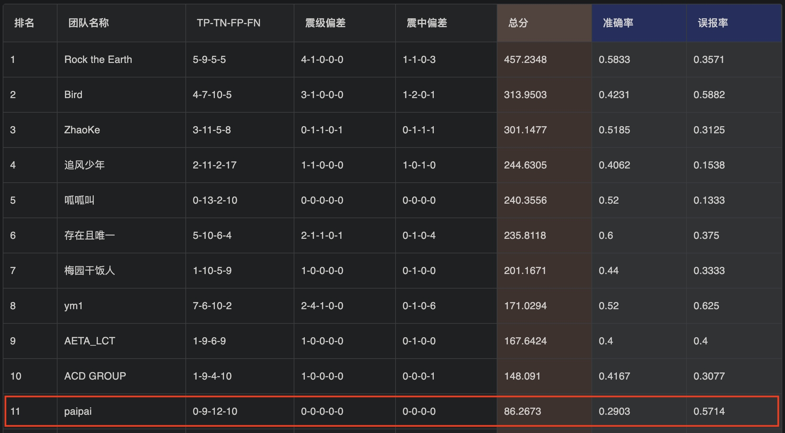

# iAETA
iAETA (基于大数据与AI的地震临震预测)

### 一、最新信息
#### 1.1 地震信息
|    | 发震时刻            |   震级(M) |   纬度(°) |   经度(°) |   深度(千米) | 参考位置                 |
|---:|:--------------------|----------:|----------:|----------:|-------------:|:-------------------------|
|  0 | 2023-11-30 20:17:11 |       3.2 |     40.17 |    106.08 |           15 | 内蒙古阿拉善盟阿拉善左旗 |
|  1 | 2023-11-30 19:25:40 |       4.1 |     40.2  |    106.13 |           21 | 内蒙古阿拉善盟阿拉善左旗 |
|  2 | 2023-11-30 15:54:58 |       5.8 |    -56.3  |    -27.35 |          100 | 南桑威奇群岛             |
|  3 | 2023-11-30 03:44:10 |       3.7 |     37.53 |    112.47 |           28 | 山西太原市清徐县         |
|  4 | 2023-11-29 20:40:42 |       3   |     36.42 |     76.07 |           10 | 新疆喀什地区塔什库尔干县 |
|  5 | 2023-11-28 07:38:47 |       3   |     41.19 |     83.7  |           10 | 新疆阿克苏地区库车市     |
|  6 | 2023-11-28 07:30:13 |       3.4 |     25.46 |    105.75 |           10 | 贵州黔西南州贞丰县       |
|  7 | 2023-11-28 06:15:47 |       3.7 |     28.6  |     87.82 |           10 | 西藏日喀则市萨迦县       |
|  8 | 2023-11-28 05:46:47 |       6.6 |     -3.7  |    143.95 |           20 | 巴布亚新几内亚附近海域   |
|  9 | 2023-11-27 22:46:46 |       3   |     24.67 |    102.94 |           10 | 云南玉溪市澄江市         |
| 10 | 2023-11-26 23:33:59 |       3   |     30.27 |     96.96 |           10 | 西藏昌都市八宿县         |
| 11 | 2023-11-26 12:31:09 |       4.8 |     24    |    122.5  |           18 | 台湾花莲县海域           |
| 12 | 2023-11-26 12:11:43 |       4.2 |     23.99 |    122.46 |           17 | 台湾花莲县海域           |
| 13 | 2023-11-26 05:02:24 |       3.1 |     41    |     82.86 |           20 | 新疆阿克苏地区沙雅县     |
| 14 | 2023-11-25 20:06:53 |       3.9 |     43.11 |     94.24 |           10 | 新疆哈密市伊州区         |
| 15 | 2023-11-24 17:05:02 |       6.9 |     20.15 |    145.55 |           10 | 马里亚纳群岛             |
| 16 | 2023-11-24 13:33:11 |       4   |     38.01 |    106.26 |           13 | 宁夏银川市灵武市         |
| 17 | 2023-11-23 00:13:13 |       4   |     39.51 |     77.23 |           17 | 新疆喀什地区伽师县       |
| 18 | 2023-11-22 12:47:30 |       6.9 |    -15.05 |    168.15 |           10 | 瓦努阿图群岛             |
| 19 | 2023-11-22 10:48:52 |       6.1 |      1.75 |    127.2  |          120 | 印尼哈马黑拉岛附近海域   |

#### 1.2 预测关联
```shell
                 #发震时刻#  #震级(M)#  #纬度(°)#  #经度(°)#  #深度(千米)#          参考位置     震级(M) 震级C      纬度(°) 纬度C       经度(°) 经度C    K        K% 经纬度解析
0   2023-11-30 20:17:11      3.2    40.17   106.08      15.0  内蒙古阿拉善盟阿拉善左旗  3.320921   ❌  28.002899      102.384965       19  0.760000   NaN
1   2023-11-30 20:17:11      3.2    40.17   106.08      15.0  内蒙古阿拉善盟阿拉善左旗  3.320921   ❌  28.002899      102.384965       19  0.760000   NaN
2   2023-11-30 19:25:40      4.1    40.20   106.13      21.0  内蒙古阿拉善盟阿拉善左旗  3.320921   ❌  28.002899      102.384965       19  0.760000   NaN
3   2023-11-30 19:25:40      4.1    40.20   106.13      21.0  内蒙古阿拉善盟阿拉善左旗  3.320921   ❌  28.002899      102.384965       19  0.760000   NaN
4   2023-11-30 15:54:58      5.8   -56.30   -27.35     100.0        南桑威奇群岛  3.548251      26.813949      102.925848       24  0.827586   NaN
5   2023-11-30 03:44:10      3.7    37.53   112.47      28.0      山西太原市清徐县  3.479667   ❌  27.635567      102.019767        5  0.833333   NaN
6   2023-11-29 20:40:42      3.0    36.42    76.07      10.0  新疆喀什地区塔什库尔干县  3.279545   ❌  29.059465      102.705080       35  0.833333   NaN
7   2023-11-28 07:38:47      3.0    41.19    83.70      10.0    新疆阿克苏地区库车市  3.419846   ❌  27.947410      102.612468       92  0.867925   NaN
8   2023-11-28 07:30:13      3.4    25.46   105.75      10.0     贵州黔西南州贞丰县  3.200000   ❌  29.613333      102.753333        1  0.500000   NaN
9   2023-11-28 05:46:47      6.6    -3.70   143.95      20.0   巴布亚新几内亚附近海域  3.241167   ❌  27.660583      101.746267       10  0.909091   NaN
10  2023-11-27 22:46:46      3.0    24.67   102.94      10.0      云南玉溪市澄江市  3.133333   ❌  27.963333      102.213333        1  0.500000   NaN
11  2023-11-26 23:33:59      3.0    30.27    96.96      10.0      西藏昌都市八宿县  3.350000   ❌  28.650667      104.271333        5  1.000000   NaN
12  2023-11-26 12:31:09      4.8    24.00   122.50      18.0       台湾花莲县海域  3.371522   ❌  27.924647      102.933893      114  0.897638   NaN
13  2023-11-26 12:31:09      4.8    24.00   122.50      18.0       台湾花莲县海域  3.371522   ❌  27.924647      102.933893      114  0.897638   NaN
14  2023-11-26 12:11:43      4.2    23.99   122.46      17.0       台湾花莲县海域  3.371522   ❌  27.924647      102.933893      114  0.897638   NaN
15  2023-11-26 12:11:43      4.2    23.99   122.46      17.0       台湾花莲县海域  3.371522   ❌  27.924647      102.933893      114  0.897638   NaN
16  2023-11-26 05:02:24      3.1    41.00    82.86      20.0    新疆阿克苏地区沙雅县  3.378018   ❌  28.073889      102.329986       84  0.800000   NaN
17  2023-11-25 20:06:53      3.9    43.11    94.24      10.0      新疆哈密市伊州区  3.340278   ❌  27.992639      103.216250        6  1.000000   NaN
18  2023-11-24 17:05:02      6.9    20.15   145.55      10.0        马里亚纳群岛  3.420221   ❌  28.114057      102.751764       23  0.884615   NaN
19  2023-11-24 13:33:11      4.0    38.01   106.26      13.0      宁夏银川市灵武市  3.104167   ❌  26.659583      103.548333        3  1.000000   NaN
20  2023-11-23 00:13:13      4.0    39.51    77.23      17.0     新疆喀什地区伽师县  3.894201      26.659375      102.425267       48  0.941176   NaN
21  2023-11-22 12:47:30      6.9   -15.05   168.15      10.0        瓦努阿图群岛  3.322054   ❌  28.214751      103.099221       89  0.917526   NaN
22  2023-11-22 10:48:52      6.1     1.75   127.20     120.0   印尼哈马黑拉岛附近海域  3.330000   ❌  28.304611      103.222167        6  1.000000   NaN
```

#### 1.3 最新预测
```shell

# 有震预测 earthquake prediction
check_my_prediction(myToken, '2023-12-02', '2023-12-08', 1, latitude=26.813949, longitude=102.925848, magnitude=3.5)

# 有震预测 earthquake prediction
check_my_prediction(myToken, '2023-12-02', '2023-12-08', 1, latitude=26.659375, longitude=102.425267, magnitude=3.9)

# 无震预测 No earthquake prediction
check_my_prediction(myToken, '2023-12-02', '2023-12-08', 0)

```

### 二、相关信息
* 中国地震台网
>
> http://www.ceic.ac.cn/history
>


* 比赛情况
>
> https://platform.aeta.cn/zh-CN/competitionpage/leaderboard
> 

